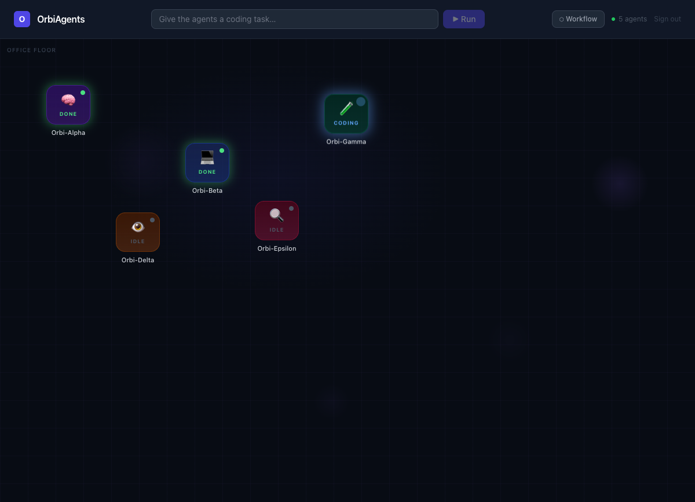

<div align="center">

# OrbiAgents

### Visual multi-agent workflow orchestration, execution, and replay

**Design an AI team, define how its agents collaborate, run the workflow, watch it execute in real time, and inspect what happened afterward.**

OrbiAgents is a visual multi-agent workflow engineering workspace. It combines workflow composition, specialized AI agents, live agent state, session replay, multiple model providers, saved workflows, usage guardrails, and a VS Code extension.

[Features](#features) · [Architecture](#architecture) · [Getting started](#getting-started) · [Current status](#current-status) · [Roadmap](#roadmap)

</div>

---



## What OrbiAgents is

OrbiAgents models work as a directed agent workflow.

A workflow can use specialized agents such as:

- **Orbi-Alpha / Planner** — breaks down the goal and proposes an implementation path
- **Orbi-Beta / Coder** — produces implementation output from the task and upstream context
- **Orbi-Gamma / Tester** — evaluates the latest implementation output
- **Orbi-Delta / Reviewer** — reviews implementation quality and risks
- **Orbi-Epsilon / Debugger** — uses code and review/test context to produce a corrected result

The workflow engine resolves dependencies between nodes, passes predecessor output forward, streams execution state to the UI, records cost and token usage, and stores sessions for replay.

```text
                 Planner
                    │
                    ▼
                  Coder
                 /     \
                ▼       ▼
             Tester   Reviewer
                \       /
                 ▼     ▼
                 Debugger
```

OrbiAgents also includes a simpler fixed Planner → Coder execution path.

> **Current runtime model:** OrbiAgents executes specialist agents through Anthropic, OpenAI, and Gemini APIs by default. Operators can explicitly enable local Claude Code or Codex CLI adapters; those runs use allowlisted, no-shell process execution and isolated Git worktrees.

## Features

### Workflow orchestration

- Fixed Planner → Coder execution path
- Dynamic DAG-based workflows
- Planner, Coder, Tester, Reviewer, and Debugger node types
- Bounded parallel execution of dependency-ready DAG branches
- Cycle detection
- Per-node streaming progress
- Pause and resume agent state
- Workflow cancellation
- Saved workflow APIs
- Maximum workflow-node guardrail

### Multi-provider AI

The orchestration server supports multiple providers behind one streaming interface:

- Anthropic Claude
- OpenAI
- Google Gemini

Provider availability is determined by which API keys are configured on the server, so the workflow runtime is not tied to one model vendor.

### Live observability

- WebSocket-powered agent state updates
- Agent status including idle, thinking, reading, coding, testing, reviewing, debugging, and done
- Current task and last action
- Per-agent logs
- Token usage tracking
- Estimated USD cost tracking
- Per-user runtime isolation
- Live workflow result delivery
- Pixel-office / coworking visual workspace
- Orbi-Prime supervisor activity and retry/circuit events
- Animated mailbox delivery and concurrent-agent indicators driven by real events
- Reduced-motion support

### Sessions and replay

- Record workflow sessions
- Capture agent-state frames during execution
- Persist supervisor and workflow observability events
- Replay completed sessions
- List previous sessions
- Record cost per run
- Generate shareable replay links
- Public replay endpoint using generated share tokens

### Accounts, persistence, and guardrails

- Email/password signup and login
- JWT-based authentication
- Persistent saved workflows
- Persistent per-agent and shared project memory
- Durable agent-to-agent mailbox messages outside workflow edges
- User-scoped workflow and session access
- Authentication rate limiting
- Workflow rate limiting
- Maximum workflow node count
- Maximum runs per hour
- Daily cost cap
- Runtime, retry, token, cost, message-hop, and consecutive-failure circuit breakers
- Protection against multiple workflows running at the same time for one user

### VS Code extension

The repository includes a separate VS Code extension that brings the OrbiAgents pixel-office experience into the editor.

Current extension capabilities include:

- Open the OrbiAgents panel
- Pixel Office webview
- Pick a workspace folder
- Diagnostics command
- Explicit Claude launch command
- Playwright end-to-end test setup

## Architecture

OrbiAgents is no longer a single Next.js MVP. The repository contains multiple product surfaces around one orchestration concept.

```text
┌─────────────────────────────────────────────────────┐
│                   Next.js Web App                   │
│        workflow UI · replay · visualization         │
└───────────────────────┬─────────────────────────────┘
                        │ HTTP + authenticated WebSocket
                        ▼
┌─────────────────────────────────────────────────────┐
│                 OrbiAgents Server                   │
│            Express · WebSocket · TypeScript         │
│                                                     │
│  auth      workflows      sessions      runtimes    │
│  memory    mailbox        supervisor    safety      │
└───────────────┬─────────────────────────────────────┘
                │
       ┌────────┼─────────┐
       ▼        ▼         ▼
   Anthropic  OpenAI    Gemini
                │
                ▼
    Runtime Adapter + Dynamic DAG Runtime
                │
 Planner → Coder → Tester ∥ Reviewer → Debugger
                │
                ▼
 state · messages · events · cost · replay
```

## Repository structure

```text
OrbiAgents/
├── app/                         # Next.js application
│   └── api/design/              # Agent-system design API route
├── server/                      # Express + WebSocket orchestration backend
│   ├── agents/                  # Planner/Coder/Tester/Reviewer/Debugger
│   ├── test/                    # Server tests
│   ├── ai.ts                    # Anthropic/OpenAI/Gemini abstraction
│   ├── runtimeAdapter.ts        # API and guarded local-CLI contracts
│   ├── workspaceIsolation.ts    # No-op and Git-worktree isolation hooks
│   ├── memoryStore.ts           # Per-agent/shared memory persistence
│   ├── mailboxStore.ts          # Independent agent messages
│   ├── supervisor.ts            # Orbi-Prime execution events
│   ├── circuitBreaker.ts        # Workflow safety budgets
│   ├── auth.ts                  # Authentication helpers
│   ├── index.ts                 # HTTP + WebSocket server
│   ├── orchestrator.ts          # Fixed Planner → Coder runtime
│   ├── runtimeState.ts          # Per-user runtime state
│   ├── sessionStore.ts          # Session/replay persistence
│   ├── workflowRunner.ts        # Dynamic DAG workflow runtime
│   └── workflowTypes.ts         # Workflow node and edge model
├── extension/                   # VS Code extension
│   ├── src/
│   ├── webview-ui/
│   └── e2e/                     # Playwright E2E tests
├── docs/
│   ├── assets/screenshots/
│   ├── architecture-next.md
│   └── coworking-space-roadmap.md
├── docker-compose.prod.yml
└── README.md
```

## Tech stack

| Area | Technology |
|---|---|
| Web dashboard | Next.js 14, React 18, TypeScript |
| Root design app | Next.js 16, React 19, TypeScript |
| Styling | Tailwind CSS |
| Server | Node.js, Express, WebSocket |
| AI providers | Anthropic SDK, OpenAI SDK, Google Generative AI |
| Data layer | Prisma |
| Authentication | JWT, bcrypt |
| VS Code integration | VS Code Extension API, webview UI |
| E2E | Playwright |
| Deployment | Docker / Docker Compose |
| Package manager | pnpm |

## Getting started

### Prerequisites

- Node.js 20+ recommended
- pnpm
- At least one supported AI provider API key

### 1. Clone the repository

```bash
git clone https://github.com/SUDARSHANCHAUDHARI/OrbiAgents.git
cd OrbiAgents
```

### 2. Run the web app

```bash
pnpm install
pnpm dev
```

The web app runs at `http://localhost:3000` by default.

### 3. Configure and run the orchestration server

In a second terminal:

```bash
cd server
cp .env.example .env
pnpm install
pnpm dev
```

The server runs at `http://localhost:4000` by default.

Configure one or more provider keys in `server/.env`:

```bash
ANTHROPIC_API_KEY=
OPENAI_API_KEY=
GEMINI_API_KEY=
```

Runtime controls can also be configured:

```bash
APP_URL=http://localhost:3000
CORS_ORIGIN=http://localhost:3000
JWT_SECRET=change-me
DEFAULT_PROVIDER=anthropic
RATE_LIMIT_AUTH_MAX=10
RATE_LIMIT_WORKFLOW_MAX=12
MAX_RUNS_PER_HOUR=30
MAX_DAILY_COST_USD=10
MAX_WORKFLOW_NODES=12
MAX_PARALLEL_AGENTS=3
LOCAL_CLI_ENABLED=false
# LOCAL_CLI_REPO_PATH=/absolute/path/to/repository
# LOCAL_CLI_WORKTREE_ROOT=/absolute/path/to/orbi-worktrees
```

Use a strong `JWT_SECRET` outside local development.

### 4. Run server tests

```bash
cd server
pnpm test
```

The server test suite covers integration behavior, runtime state, session storage, and workflow execution logic.

### 5. Build the VS Code extension

```bash
cd extension
pnpm install
pnpm build
```

Run its Playwright E2E suite with:

```bash
pnpm e2e
```

## API and runtime highlights

The server currently exposes runtime capabilities for:

- health checking
- signup and login
- available AI providers
- usage reporting
- fixed workflow execution
- dynamic workflow execution
- workflow cancellation
- saved workflow CRUD
- persistent agent/shared memory
- agent-to-agent mailbox messaging
- session listing and replay
- replay sharing
- authenticated WebSocket state updates
- supervisor and circuit-breaker observability events

The implementation in `server/` is the source of truth for current runtime behavior.

### Opt-in local coding runtimes

After setting the three `LOCAL_CLI_*` variables above and restarting the server, `GET /runtimes` lists the enabled adapters. Select one on a dynamic workflow request with `"runtimeId": "codex-cli"` or `"runtimeId": "claude-cli"`. Omitting `runtimeId` keeps the existing provider API path.

Local commands are spawned without a shell from a fixed allowlist. Each node runs in a dedicated branch and Git worktree outside the source repository. Clean worktrees are removed after the node finishes; worktrees containing agent changes are preserved, and their path is returned in the corresponding workflow result step for operator review. OrbiAgents does not automatically commit, merge, push, or delete those changes.

The web workspace lists the runtime adapters enabled by the server, displays preserved worktrees, shows their changed-file and patch summaries, and can apply explicitly selected tracked files only after confirmation and a clean-target check. Its Context panel supports agent/shared memory editing and deletion, typed threaded mailbox replies, inbox review, and read status. Preserved-workspace registry entries are stored in the same local Prisma/SQLite database, so registered dirty worktrees remain discoverable after a server restart.

Memory prompt injection is disabled by default. A user can enable it for a run; OrbiAgents then supplies a bounded set of unexpired shared and per-agent memories. Memory entries can optionally carry retention periods.

## Current status

| Capability | Status |
|---|---|
| Visual multi-agent workspace | ✅ Built |
| Planner / Coder / Tester / Reviewer / Debugger | ✅ Built |
| Dynamic DAG workflows | ✅ Built |
| Anthropic / OpenAI / Gemini provider layer | ✅ Built |
| Live WebSocket agent state | ✅ Built |
| Authentication and per-user runtime | ✅ Built |
| Saved workflows | ✅ Built |
| Session replay | ✅ Built |
| Shareable replay | ✅ Built |
| Cost / usage guardrails | ✅ Built |
| VS Code extension | ✅ Built |
| Server tests | ✅ Built |
| Extension Playwright E2E setup | ✅ Built |
| Bounded parallel execution of independent DAG branches | ✅ Built |
| Persistent per-agent and shared memory | ✅ Built |
| Direct agent mailbox / messaging | ✅ Built |
| Orbi-Prime supervisor policy and event layer | ✅ Built |
| Circuit breakers for runtime/retries/tokens/cost/failures | ✅ Built |
| API runtime adapter | ✅ Built and default |
| Codex and Claude Code CLI adapters | ✅ Opt-in for dynamic workflows; disabled by default |
| Git worktree isolation | ✅ Required for local CLI nodes; dirty worktrees are preserved |
| Runtime and preserved-workspace operator UI | ✅ Built |
| Restart-persistent preserved-workspace registry | ✅ Built |
| Agent/shared memory and mailbox operator UI | ✅ Built |
| Bounded supervisor retry/stop recovery selection | ✅ Built |
| Approval-gated Orbi-Prime workflow proposals | ✅ Built |
| Local memory relevance retrieval and retention presets | ✅ Built |
| Explicit untracked-file workspace review/application | ✅ Built |
| Replay seeking and timeline controls | ✅ Built |
| Replay bookmarks and event-type filters | ✅ Built |
| Optional OpenAI embedding memory retrieval with local fallback | ✅ Built; opt-in |
| Text preview and binary classification for new workspace files | ✅ Built |
| Duplicate-role removal with validated dependency rewiring | ✅ Built; approval-gated |
| Persistent local embedding cache | ✅ Built; user-scoped |
| Persistent replay bookmarks per user/session | ✅ Built |
| Bounded PNG/JPEG/GIF/WebP preview metadata | ✅ Built |
| Configurable supervisor proposal policies and history | ✅ Built |
| Bounded embedding-cache retention and metrics | ✅ Built |
| Labeled private/shared replay bookmarks | ✅ Built |
| Proposal comparison and restore previews | ✅ Built; approval-gated |
| Dashboard embedding-cache metrics | ✅ Built |
| Previous/next bookmark navigation | ✅ Built |
| Autonomous supervisor workflow mutation | 🧭 Not enabled |

## Product direction

The goal is not simply to display agents in an office.

The visual environment is intended to become an **observability surface for the workflow**: where agents are working, what they are doing, what they received from upstream agents, what they produced, how much they cost, where a run failed, and how execution changed over time.

That direction is captured in the [coworking-space roadmap](docs/coworking-space-roadmap.md), which explores zone-aware agent behavior, collaboration states, session analytics, workflow-aware placement, and shared visual concepts across the web app and VS Code extension.

## Roadmap

The next architectural milestones are focused on making orchestration deeper rather than adding decorative complexity:

1. Add richer proposal diff visualization for large workflow graphs
2. Add bookmark editing without recreating a bookmark
3. Add cache hit-rate telemetry without logging memory content
4. Consider server-side image decoding only if richer inspection is needed

## Why OrbiAgents

OrbiAgents is built around a workflow-first idea:

> **Design the AI team, define how it works, watch it execute, inspect exactly what happened, and improve the workflow.**

Rather than hiding orchestration behind a chat window, OrbiAgents makes the workflow itself visible and inspectable.

## Security notes

- Keep provider API keys server-side and out of source control
- Do not commit `server/.env`
- Use a strong production `JWT_SECRET`
- Protected endpoints require authentication
- User workflows and sessions are scoped by user ID
- WebSocket connections require a valid token
- Configure rate limits and usage caps for the deployment environment
- Treat public replay links as shareable access to the associated replay

## Contributing

Contributions are welcome.

1. Fork the repository
2. Create a focused feature branch
3. Make and test your changes
4. Open a pull request with the problem, approach, and validation clearly described

## Inspiration and credits

The coworking-space presentation and its animated sense of agent activity were inspired in part by **Munder** and by the pixel-art environment work of **LimeZu**. Thank you to their creators for demonstrating how a shared virtual workspace can make collaboration feel understandable and alive.

OrbiAgents' current interface, animations, and visual assets are original implementations. No Munder or LimeZu artwork, source assets, branding, or other third-party files are included in this repository. Their respective projects and assets remain subject to their own license terms.

## License

MIT License. See [LICENSE](LICENSE).

## Project links

- [GitHub Issues](https://github.com/SUDARSHANCHAUDHARI/OrbiAgents/issues)
- [Coworking Space Roadmap](docs/coworking-space-roadmap.md)

---

<div align="center">

Built by [SUDARSHANCHAUDHARI](https://github.com/SUDARSHANCHAUDHARI)

</div>
